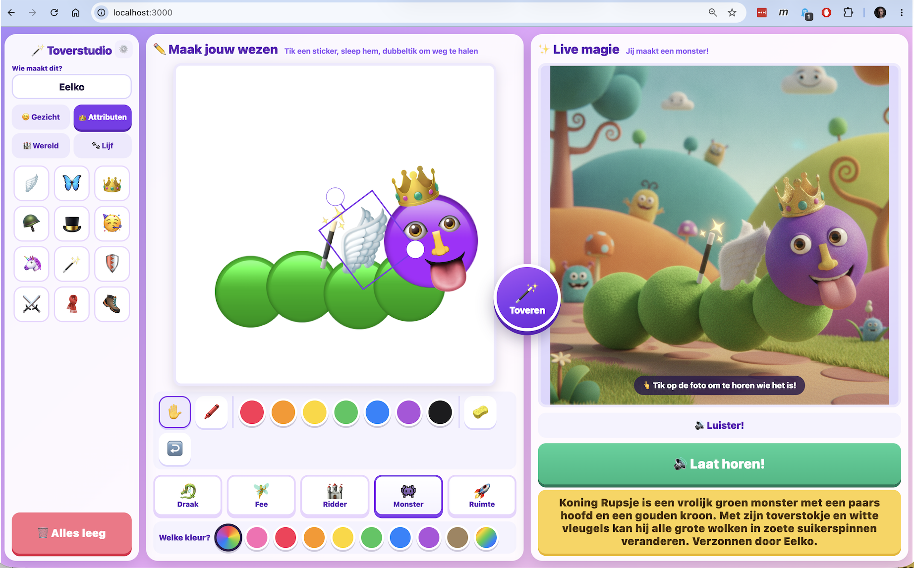
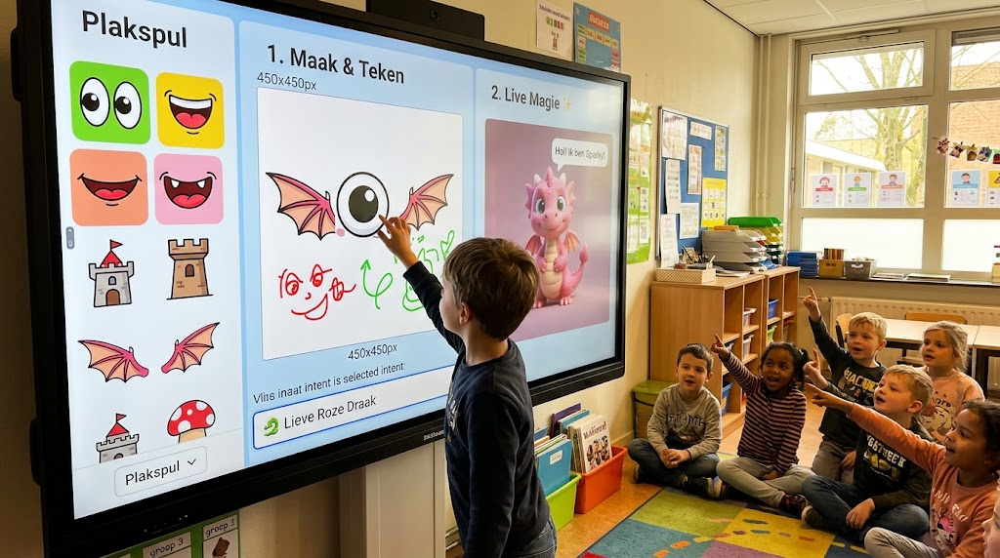

# Digibord AI Toverstudio

Een lokale webapp voor het digibord waarmee kinderen van ongeveer zes jaar een
figuur samenstellen uit stickers en stiftstreken, en dat met één tik op de
toverknop laten omtoveren tot een 3D-plaatje. Daarna vertelt een stem een
verhaaltje van twee zinnen over wat ze gemaakt hebben, afgesloten met
"verzonnen door \<naam van het kind\>".

Alles draait op de laptop van de leerkracht. De API-sleutels blijven op die
laptop en komen niet in de browser terecht.



Links kiest het kind stickers, in het midden bouwt het de figuur op en rechts
staat het resultaat met het verhaaltje. De ronde toverknop tussen de twee vlakken
zet de tekening om.

## Wat je nodig hebt

- **Node.js 18 of nieuwer.** Check met `node -v`. Getest op Node 26.
- **pnpm.** Installeer met `npm install -g pnpm` of via `corepack enable`.
- **Een Google Gemini API-sleutel.** Nodig om te kunnen tekenen. Gratis aan te
  vragen op <https://aistudio.google.com/apikey>.
- **Een ElevenLabs API-sleutel.** Optioneel. Zonder deze sleutel leest de
  browser het verhaaltje voor met de ingebouwde stem, wat werkt maar minder
  leuk klinkt. Zie ook "Let op bij ElevenLabs" hieronder.
- **Een fal.ai sleutel.** Optioneel, alleen als terugval. Zie "Andere
  tekenmotor".

## Installeren

```bash
git clone git@github-eelkonio:eelkonio/groep3-toverstudio.git
cd groep3-toverstudio
pnpm install
```

`github-eelkonio` is een host-alias uit `~/.ssh/config` van de auteur. Heb je die
alias niet, gebruik dan `git@github.com:eelkonio/groep3-toverstudio.git`.

Maak daarna je eigen `.env` op basis van het voorbeeld:

```bash
cp .env.example .env
```

Zet in `.env` minimaal je Gemini-sleutel:

```env
GEMINI_API_KEY=jouw_gemini_sleutel
```

Heb je de sleutel al in `~/.gemini_api_key` staan, bijvoorbeeld voor een andere
tool, dan mag `GEMINI_API_KEY` leeg blijven. De server leest dan automatisch
`~/.gemini_api_key` of `~/.config/gemini/api_key`.

Voor stemmen zet je er ook dit in:

```env
ELEVENLABS_API_KEY=jouw_elevenlabs_sleutel
```

## Starten

```bash
pnpm start
```

Open daarna <http://localhost:3000> op het digibord en zet de browser in
volledig scherm (F11, of op macOS `cmd` + `ctrl` + `F`). De app is gemaakt voor
liggend gebruik op minimaal 1920x1080.

Bij het opstarten zie je in de terminal welke onderdelen werken:

```
Digibord AI Toverstudio -> http://localhost:3000
Tekenmotor    gemini  [gemini-2.5-flash-image]  sleutel OK
Stemtekst     OK  [gemini-3.6-flash]
Stem          random uit 21 stemmen
```

Tijdens ontwikkelen kun je `pnpm dev` gebruiken; die herstart bij elke
wijziging in `server.js`.

## Hoe je het gebruikt

1. Het kind typt zijn of haar naam linksboven bij "Wie maakt dit?".
2. Stickers aantikken in de linkerbalk, ze verschijnen op het canvas. Slepen met
   één vinger, dubbeltikken haalt ze weg, met de hoek-pin maak je ze groter.
3. Met de viltstift erbij tekenen, in zeven kleuren. De gum haalt weg wat je
   aantikt.
4. Onder het canvas kies je een thema (draak, fee, ridder, monster, ruimte) en
   een kleur.
5. Tik op de ronde **toverknop** tussen de twee vlakken. Die pulseert zodra er
   iets veranderd is. Er gebeurt niets automatisch, dus er gaan geen calls uit
   zolang niemand tikt.
6. Tik op **Laat horen** of op het plaatje voor het verhaaltje. Een tweede keer
   tikken speelt dezelfde audio opnieuw af zonder nieuwe calls.
7. **Alles leeg** wist het canvas en de naam, klaar voor het volgende kind.

Rechtsboven in de zijbalk zit een tandwiel met een veld voor een eigen
beschrijving die aan de prompt wordt toegevoegd, plus de laatst verstuurde
prompt zodat je kunt zien wat er precies naar het model ging. Engels werkt daar
beter dan Nederlands.

## Waar het werk terechtkomt

Elke omzetting schrijft drie bestanden naar `generated-images/`. Die map maakt de
server bij het opstarten zelf aan, dus je hoeft niets voor te bereiden na een
verse clone. De drie bestanden krijgen dezelfde basisnaam zodat ze bij elkaar
horen:

```
2026-09-18T19-11-34-563Z__sanne__ruimte__input-canvas.jpg   de tekening
2026-09-18T19-11-34-563Z__sanne__ruimte__output-gemini.png  het resultaat
2026-09-18T19-11-34-563Z__sanne__ruimte__output-gemini.mp3  het verhaaltje
```

De naam van het kind zit in de bestandsnaam zodat je achteraf het juiste werk
naar de juiste ouders kunt sturen. Die map staat in `.gitignore`, dus werk van
kinderen komt niet per ongeluk in de repository terecht. Wil je niets opslaan,
zet dan `SAVE_IMAGES=false` in `.env`.

## Instellingen

Alles staat in `.env`, met uitleg per regel in `.env.example`. De belangrijkste:

| Variabele | Standaard | Wat het doet |
| --- | --- | --- |
| `PORT` | `3000` | Poort van de lokale server |
| `RENDER_ENGINE` | `gemini` | `gemini` of `fal` |
| `GEMINI_IMAGE_MODEL` | `gemini-2.5-flash-image` | Model dat het plaatje maakt |
| `GEMINI_MODEL` | `gemini-3.6-flash` | Model dat het verhaaltje schrijft |
| `ELEVENLABS_VOICE_MODE` | `random` | `random` uit de pool, of `thema` |
| `ELEVENLABS_VOICE_POOL` | 21 stemmen | Komma-lijst met voice-id's |
| `SAVE_IMAGES` | `true` | Alles opslaan in `generated-images/` |
| `FAL_LEAD` | zie `.env.example` | Eerste regel van de prompt |
| `FAL_STYLE` | zie `.env.example` | Stijltermen aan het eind van de prompt |

De naam `FAL_LEAD` en `FAL_STYLE` is historisch: ze gelden voor beide
tekenmotoren, niet alleen voor fal.

## Let op bij ElevenLabs

Op een **gratis** ElevenLabs-plan kun je via de API alleen `premade` stemmen
gebruiken. Library- en professional-stemmen geven:

```
402 paid_plan_required
"Free users cannot use library voices via the API"
```

Daarom staat er in `.env.example` een pool met 21 premade stemmen die op een
gratis plan werken. Per verhaaltje wordt daar willekeurig één uit gekozen, en
nooit twee keer achter elkaar dezelfde. Geen van die 21 is Nederlands: ze
spreken Nederlands met een Engels accent via `eleven_multilingual_v2`.

Heb je een betaald plan, dan kun je per thema een eigen stem instellen:

```env
ELEVENLABS_VOICE_MODE=thema
ELEVENLABS_VOICE_ID_DRAAK=...
ELEVENLABS_VOICE_ID_FEE=...
ELEVENLABS_VOICE_ID_RIDDER=...
ELEVENLABS_VOICE_ID_MONSTER=...
ELEVENLABS_VOICE_ID_RUIMTE=...
```

Wil je weten welke stemmen jouw sleutel mag gebruiken, geef de sleutel dan het
recht `voices_read` en vraag `https://api.elevenlabs.io/v1/voices` op.

## Andere tekenmotor

Standaard tekent Gemini. Dat model begrijpt de tekening inhoudelijk: een
getekende raket wordt een raket, met de raampjes en de vlam op hun plek.

Weigert Gemini, of is je quotum op, dan schakel je over naar fal.ai:

```env
RENDER_ENGINE=fal
FAL_KEY=jouw_fal_sleutel
FAL_MODE=controlnet       # of img2img
FAL_CONTROL_SCALE=0.5     # hoe leidend de tekening is, 0 tot 1
```

Die route gebruikt ControlNet en volgt de compositie strakker, maar weet niet
wát er getekend is: hij legt vorm en licht over de lijnen heen. Het eerste
plaatje na het opstarten kan bij fal een paar minuten duren door een cold start.
Zet `FAL_WARMUP=true` en start de server een paar minuten voor de les, dan valt
dat wachten buiten de les.

## Interne registry

In dit project staat `.npmrc` in `.gitignore`. Op de laptop waar dit gebouwd is
verwijst dat bestand naar een interne Artifactory-registry, en dat werkt niet
buiten dat netwerk. Kloon je de repo, dan gebruikt `pnpm install` gewoon de
standaard registry.

Werk je zelf achter zo'n interne registry, maak dan lokaal een `.npmrc`:

```
registry=https://jouw-registry/api/npm/npm-all/
```

De `pnpm-lock.yaml` in de repo bevat alleen integrity-hashes en geen
registry-URL's, dus die werkt in beide situaties.

## Problemen oplossen

**De statusbalk zegt dat er geen sleutel is.** Controleer `.env` of
`~/.gemini_api_key`. `GET /api/health` laat zien wat de server denkt te hebben.

**Het verhaaltje klinkt als een computerstem.** Dan viel hij terug op de
browserstem. Kijk in de terminal naar een regel met `[elevenlabs] error`. Bij
`402 paid_plan_required` gebruik je een stem die je plan niet toestaat.

**Het plaatje blijft zwart.** De server meet de helderheid van elk resultaat en
keurt een zwart beeld af. Het vorige plaatje blijft dan staan en het afgekeurde
frame wordt bewaard met `AFGEKEURD-zwart` in de naam. Er gaat geen nieuwe call
uit; tik zelf opnieuw op de toverknop.

**fal zegt `User is locked. Reason: TOP_UP`.** Je fal-tegoed is op. Waarderen
op via je fal-account, of terug naar `RENDER_ENGINE=gemini`.

**Een Gemini-model geeft 404.** Google faseert modellen uit. De foutmelding
noemt meestal het nieuwe model; zet dat in `GEMINI_MODEL` of
`GEMINI_IMAGE_MODEL`.

**Het canvas gaat zwart naar het model.** Dat hoort niet meer te kunnen: de
export zet de tekening eerst op een wit vlak. Kijk bij twijfel naar het
bewaarde `input-canvas` bestand om te zien wat er verstuurd is.

## Routes

De frontend praat met vier routes op de lokale server:

| Route | Wat het doet |
| --- | --- |
| `GET /api/health` | Welke motor en sleutels actief zijn |
| `POST /api/render-live` | Tekening omzetten naar een plaatje |
| `GET /api/image/:renderId` | De bytes van een gemaakt plaatje |
| `POST /api/speak` | Verhaaltje maken en inspreken |

## Projectstructuur

```
server.js              Express-server, prompts, Gemini, fal en ElevenLabs
public/index.html      De hele interface
public/css/styles.css  Styling, touch-maten voor het digibord
public/js/stickers.js  Stickers, thema's en kleuren
public/js/app.js       Canvas, toverknop, audio
images/                Schermafbeelding en sfeerbeeld voor deze README
.env.example           Alle instellingen met uitleg
```

## Waar het uiteindelijk om gaat



Een kind aan het bord, de rest van de groep op de grond, en iedereen die wil weten
wat er tevoorschijn komt. Daar is dit voor gemaakt.

*Dit sfeerbeeld is een impressie, geen schermafbeelding. De echte interface staat
bovenaan deze README.*
